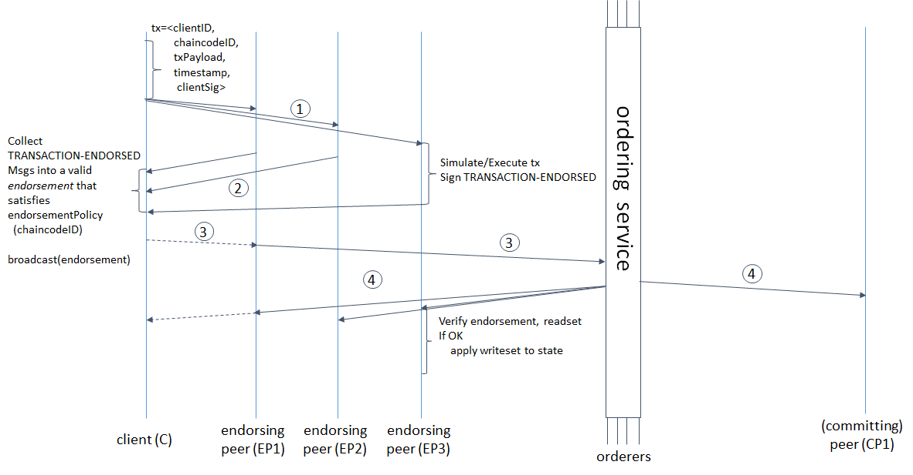
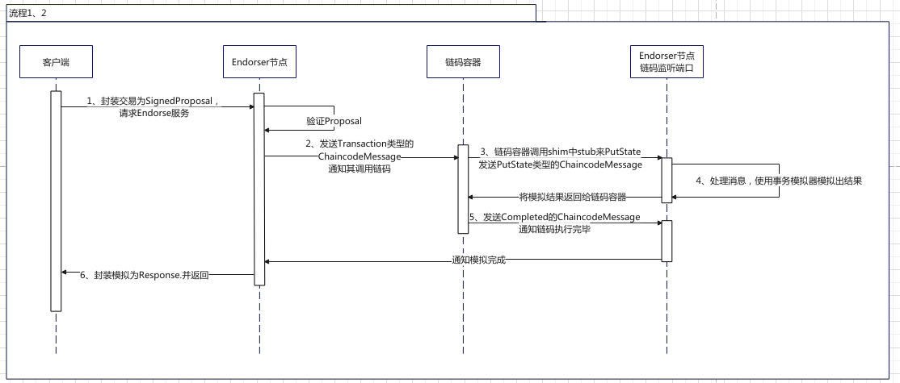

## Fabric概念介绍和梳理

[toc]

### 一、概要


Fabric有大量的概念，我会以一定的逻辑顺序按照一定的分类大致介绍这些概念：

1. 节点：

   1. 逻辑：我们刚部署完fabric网络，对节点相对比较熟悉，它们也是各种概念的载体，比较适合作为出发点
   2. 内容：peer、orderer、cli等

2. 数据：

   1. 逻辑：区块链核心就是对数据的存储，我们必须了解各个节点要存储哪些数据
   2. 内容：channel通道、ledger账本、世界状态world state、区块链blockchain、区块block、交易transaction等

3. 交易流程和节点提供的服务

   1. 逻辑：区块链上所有数据的修改都是通过transaction完成的，我们有必要去大致了解一下交易的流程以及完成这个流程各个节点完成的事以及提供的服务
   2. 内容：交易流程、排序服务、背书服务、Deliver服务、AtomciBroadcast服务、Gossip服务 

4. 排序服务和共识

   1. 逻辑：是排序服务的扩展，这里涉及区块链最重要的机制共识
   2. 内容：各个版本可选择的共识机制

5. 背书服务和链码

   1. 逻辑：背书服务的核心就是链码的执行，这块主要介绍链码的概念
   2. 内容：链码、背书策略

6. 身份和权限

   1. 逻辑：之前忽略了身份和权限的概念，这时候适合提及
   2. 内容：组织、身份、FabricCA、MSP、策略、配置

   

   

### 二、节点


1. 节点：任意类型的节点都需要绑定一个身份（证书），属于一个组织，他们之间采用P2P的方式通信，即既可以作为客户端也可以作为服务端
2. 普通peer节点：https://hyperledger-fabric.readthedocs.io/en/release-2.5/peers/peers.html
   1. 存储账本的节点，Fabric是一个允许多账本的网络，每个peer节点允许维护多个账本
3. Endorse节点：
   1. 安装有交易所对应链码的peer节点就是对应交易的背书节点，只有这些节点有能力执行交易，其他peer节点只是导入背书产生的读写集
4. LeaderPeer节点：
   1. 一个组织内部向Orderer节点拉取对应通道的区块，并分发给组织内其他peer节点
   2. Leader节点通过Gossip协议在组织内动态选举
5. AnchorPeer节点：
   1. peer节点通常只维护组织内peer的发现服务，对于其他组织的节点仅维护anchor节点，通过anchor节点与其他组织交互
   2. anchor节点在channel的配置区块中设置，包括endpoint(ip + port)信息
   3. 最初peer节点不知道组织内其他peer节点，仅通过配置区块知道anchor节点，再通过anchor认识组织内其他peer节点，作用很重要
6. Orderer节点：https://hyperledger-fabric.readthedocs.io/en/release-2.5/orderer/ordering_service.html
   1. Fabric将处理交易和打包交易出块进行了拆分，peer节点处理交易，orderer节点对交易排序出块
   2. 一般区块链共识的范围是所有节点，fabric的共识是订阅了对应通道的所有orderer节点
7. 客户端节点：
   1. 访问fabric网络的节点，可以是命令行调用，也可以是java、go、javascript编写的客户端


### 三、数据


1. channel通道：https://hyperledger-fabric.readthedocs.io/en/release-2.5/channels.html

   1. 它其实不算数据相关的概念，它代表的是整个Fabric网络的一个子集，这个子集内的成员会维护一个账本ledger
   2. 子集的范围由channel的配置决定，它配置的方式为允许哪些组织参与该channel

2. ledger账本：https://hyperledger-fabric.readthedocs.io/en/release-2.5/ledger/ledger.html

   1. 一个通道对应一个账本，账本包括区块链以及区块所累积得到的世界状态

3. 世界状态：

   1. 简单来说就是一个key-value的Map，它的实现一般就是一个NoSql
   2. 它的状态会由且仅由交易完成，一般称之为基于交易的状态复制机，只要输入的交易一样，最终的得到的结果也一样

4. 区块链：

   1. 就是由区块构成的链，由区块中的prevHash来连接上一个区块
   2. 在Fabric中的实现就是文件，以一个个blockFile构成

5. 区块：

   1. 就是很正常的一个区块

      1. block data中存储了多个交易
      2. blockheader中存储了datahash,它是blockdata的hash值，prevhash存储了上一个区块的datahash,用于连接成区块链

      

6. 交易

   1. 一般来说，交易就是对一次对链码的调用，里面会包含

      1. 调用的链码名(chaincodeName)、交易名（contractName:transactionName，链码提供的一个接口），代表调用那个链码和链码中哪个接口
      2. 链码调用的入参、返回值
      3. 链码背书的读写集，链码的本质就是对世界状态的CRUD,对应的也会产生的key-value读写集

   2. 区块中存储的可能是配置或是交易，我们可以把配置视为一种特殊的交易，不多做考虑，我们仅考虑调用链码的交易;

7. 私有数据

   1. 

   2. 

      

### 四、交易流程和节点提供的服务

交易流程：https://hyperledger-fabric.readthedocs.io/en/release-2.5/txflow.html?highlight=transaction

1. 客户端初始化一个Transaction

   客户端A调用SDK，产生transaction proposal，它包含调用链码所需的参数，将proposal发送给该链码的背书策略所需要的Endorser节点。

   这块目前，我还没有过多涉及。

2. 背书节点验证proposal并模拟事务，返回背书结果

   

   1. 收到proposal的背书节点检查
      1. proposal是否合法
      2. 是否已经被提交
      3. 检查proposal是否被调用者用户Client A正确签名
      4. 确保Client A 有权利去执行该操作
   2. 把proposal提供参数作为chaincode的输入，根据当前的world state进行执行，生成事务结果，包括response value、read set、write set。目前不会对ledger进行修改
   3. 以上的事务结果在被背书节点签名后，作为proposal response返回给Client A

3. 检测proposal response

   1. Client A 验证收到的proposal response是否符合签名，并且比较response是否相同
   2. 如果是query response，则不必提交给orderer节点
   3. 把其中一致的proposal response写入到transaction中，判断是否满足背书政策，如果满足再提交给orderer节点，当然之后会有其他措施保证其符合

4. 客户端合并背书到事务中，并且将事务发送给排序服务，完成排序上链

   交易中包含读写集、背书节点的签名和channel ID，排序节点无需完成最终检查任务，只需要把事务按时间和channel进行排序，并且创建事务block

5. 区块分发，事务被验证和提交

   1. 排序节点把封装有transaction的block分发给所有加入对应channel的peers
   2. 每个peer会去检查区块中的事务
      1. 事务是否符合背书策略
      2. 根据事务中的read set，判断world state是否在期间有被修改过
   3. 根据以上判断，给block中的每个transaction打上是否有效的标签

6. 修改账本

   1. peer节点将区块添加到区块链上
   2. 将所有有效的事务的写集提交给world state 数据库
   3. 发送一个event给Client A，通知事务是否有效

   
   
   

Fabric的交易流是区块链中比较特殊的一种交易流，一般交易流可以分为：

1. 先定序后执行：先通过共识将所有交易排好序出块，块到节点手上再验证并执行
   1. 一般公链都采用这种方案，该方案是必须所有节点都执行每个交易

2. 先执行后定序：先执行出结果，将结果连同交易发送给出块者，出块者排好序后发送节点，节点拿到块后仅验证
   1. Fabric和部分联盟链采用该方案，它的优点是允许仅部分节点执行，而不用所有节点去执行
   2. 不过也会伴随一个缺点：由于执行时不知道交易的顺序，一个区块的交易仅可根据上一个区块的世界状态作为输入，而不能以上一个交易产生的世界状态作为输入；一个区块不能对同一个key同时读写


注意：这里的提到的服务类似我们用的前后端接口文档，是一个节点对外暴露的接口

1. 背书服务
   1. 由endorser节点提供，用于对client节点提供的交易proposal进行背书，执行交易对应的链码，得到对应的读写集
2. Broadcast服务
   1. 由orderer节点提供，主要由client节点（v2.3后由peer节点）调用，将满足背书策略的proposal发送给Orderer节点，等待排序打包出块
3. Cluster服务（排序服务）：https://hyperledger-fabric.readthedocs.io/en/release-2.5/orderer/ordering_service.html
   1. 由orderer节点提供，orderer节点之间互相调用，用于实现不同的共识算法
4. Deliver服务
   1. 由orderer节点提供，由peer节点调用，用于拉取对应channel的区块
   2. peer节点也会提供，由client节点调用，也用于拉取对应channel的区块
5. Gossip服务：https://hyperledger-fabric.readthedocs.io/en/release-2.5/gossip.html
   1. 由peer节点提供，peer节点之间互相调用，核心是用于保证peer之间的最终一致性
6. Discovery服务
   1. 由peer节点提供，client和peer节点都可以调用，主要用于查询其他peer维护的配置信息、链码信息、存活peer信息等


### 五、排序服务和共识

共识的范围：仅在orderer节点之间进行

共识算法：

1. Solo共识：单orderer节点打包出块
2. Kafka共识：依靠kafka和zookeeper集群来完成共识，其共识关键是靠zookeeper的Zab协议，v2.0起不建议使用，v2.5已经从源码中删除
3. PBFT共识：v0.6版本采用的，已经被废除
4. Raft共识：跟kafka一样，也都是分布式一致性算法实现的共识算法，很建议去详细学习一下，v2.0首推的共识算法
5. SmartBFT：现在还没有出现在官方文档中，但是v2.5的源码中已经有了该实现，自v0.6以后，fabric重新支持BFT算法，而不是仅仅是CFT算法


### 六、背书服务和链码

链码（chaincode）：就是Fabric中的智能合约。

长啥样：

```java
@Contract(name="asset")
public final class AssetTransfer implements ContractInterface {
    @Transaction(intent = Transaction.TYPE.SUBMIT, name = "CreateAsset")
    public Asset CreateAsset(final Context ctx, final String assetID, final String color, final int size,
        final String owner, final int appraisedValue) {
        ChaincodeStub stub = ctx.getStub();
        Asset asset = new Asset(assetID, color, size, owner, appraisedValue);
        // Use Genson to convert the Asset into string, sort it alphabetically and serialize it into a json string
        String sortedJson = genson.serialize(asset);
        stub.putStringState(assetID, sortedJson);
        return asset;
    }

    @Transaction(intent = Transaction.TYPE.EVALUATE)
    public Asset ReadAsset(final Context ctx, final String assetID) {
        ChaincodeStub stub = ctx.getStub();
        String assetJSON = stub.getStringState(assetID);
        Asset asset = genson.deserialize(assetJSON, Asset.class);
        return asset;
    }
}
```

像什么：我们写的后端，这个类似把业务逻辑写在Controller里面的后端代码

```java
@RequestMapping(path="/bms/contract")
public class ContractController {
    @RequestMapping(method = {RequestMethod.POST}, path="/create")
    public ResultVO<ContractVO> createContract(@RequestBody ContractCreateDTO createDTO) {
        ContractVO contract = contractService.createContract(createDTO);
        return new ResultVO<ContractVO>(ResultCodeEnum.SUCCESS).putData(contract);
    }
    
    @RequestMapping(method = {RequestMethod.GET}, path="/{id}")
    public ResultVO<ContractSimpleVO> getContract(@PathVariable Long id) {
        ContractSimpleVO contract = contractService.getSimpleContract(id);
        return new ResultVO<ContractSimpleVO>(ResultCodeEnum.SUCCESS).putData(contract);
    }
}
```


链码是如何被调用的？

核心是启动一个链码容器，它部署了链码，每当需要对世界状态访问时，它会向endorser节点本身进行连接，对数据进行请求和修改



像啥：

客户端 —— 》前端

Endorser节点——》Tomcat服务器

链码容器——》后端服务器

Endorser节点接收数据连接的接口——》数据库


我们也可以从这个角度去考虑区块链与我们一般写的后端应用的关系：

1. 区块链——》调用后端接口的日志
2. 世界状态——》当前数据库存储的数据
3. 一个链码——》一个后端应用（微服务），链码之间的数据是隔离的，但是可以通过链码互相调用来访问其他链码的数据


背书：简单来说就是执行一遍链码，然后记录下期间读取到的所有key-value，同时也记录下期间写入的所有key-value，这两者构成了读写集，再把这些读写集使用其证书做一个数字签名。

背书策略：一个交易要提交给orderer节点排序，需要满足背书策略。client节点（v2.3后这件事由peer节点来做）需要找不同组织的背书节点进行背书，收集背书直到满足背书策略。


系统链码：

1. _lifecycle（链码生命周期）：用于部署链码，主要是ApproveForMyOrg和Commit两个
2. CSCC(配置)：用于修改和查询配置
3. QSCC(查询)：用于查询区块和交易
4. ESCC(背书)：用于为背书信息签名等功能
5. VSCC(验证)：用于验证一个交易，判断背书是否合法、读写集版本是否正确等


### 七、身份和权限


#### 1. 组织

https://hyperledger-fabric.readthedocs.io/en/release-2.5/glossary.html?highlight=organization#organization

一个比较抽象的概念，一般对应现实中一个企业组织，它的地位主要通过以下与其他概念的关系得到体现：

- 组织会被配置在通道的配置区块中，组织中会配置该组织的MSPID，以及该组织使用的根证书和中间证书，只有使用这些证书签发的证书才是属于该组织的

  ```json
  {
      
      "Org1MSP": {
          "values": {
              "MSP": {
                  "mod_policy": "Admins",
                  "value": {
                      "config": {
                          "admins": [],
                          "crypto_config": {
                              "identity_identifier_hash_function": "SHA256",
                              "signature_hash_family": "SHA2"
                          },
                          "intermediate_certs": [],
                          "name": "Org1MSP",
                          "organizational_unit_identifiers": [],
                          "revocation_list": [],
                          "root_certs": [
                              "LS0tLS1CRUdJTiBDRVJUSUZJQ0FURS0tLS0tCk1JSUNKekNDQWMyZ0F3SUJBZ0lVVHJDK0x4SXVMRitQSHVlbUxzakxEaWJHK1VJd0NnWUlLb1pJemowRUF3SXcKY0RFTE1Ba0dBMVVFQmhNQ1ZWTXhGekFWQmdOVkJBZ1REazV2Y25Sb0lFTmhjbTlzYVc1aE1ROHdEUVlEVlFRSApFd1pFZFhKb1lXMHhHVEFYQmdOVkJBb1RFRzl5WnpFdVpYaGhiWEJzWlM1amIyMHhIREFhQmdOVkJBTVRFMk5oCkxtOXlaekV1WlhoaGJYQnNaUzVqYjIwd0hoY05Nak13T0RBNE1ERTFNVEF3V2hjTk16Z3dPREEwTURFMU1UQXcKV2pCd01Rc3dDUVlEVlFRR0V3SlZVekVYTUJVR0ExVUVDQk1PVG05eWRHZ2dRMkZ5YjJ4cGJtRXhEekFOQmdOVgpCQWNUQmtSMWNtaGhiVEVaTUJjR0ExVUVDaE1RYjNKbk1TNWxlR0Z0Y0d4bExtTnZiVEVjTUJvR0ExVUVBeE1UClkyRXViM0puTVM1bGVHRnRjR3hsTG1OdmJUQlpNQk1HQnlxR1NNNDlBZ0VHQ0NxR1NNNDlBd0VIQTBJQUJOWW8KMStsUVY0TzR2RVRBanU4aTBHU1BrUzc5OHNIOGFwNnpOaTQ3d2Z1cDkwRlp5QjdiRXZoZnIxVUtFQ08wd3V1cQpRSVNrcDZBNDRmNVZqVVk3MjV1alJUQkRNQTRHQTFVZER3RUIvd1FFQXdJQkJqQVNCZ05WSFJNQkFmOEVDREFHCkFRSC9BZ0VCTUIwR0ExVWREZ1FXQkJROEo0VGVzVEtjT2NaQUNkNWN3UndaVTFmeit6QUtCZ2dxaGtqT1BRUUQKQWdOSUFEQkZBaUVBcit4dFF3aUpuODRBbzl5VExNZXhJNEZpZTlmR2xqVC9nRkYvU2FPaU1WSUNJRVQ3RWxxNApwWEoyVFBvOFBnT2lUVmZaMytDSTR0djZPTDBHV05KMWVBY3oKLS0tLS1FTkQgQ0VSVElGSUNBVEUtLS0tLQo="
                          ],
                          "signing_identity": null,
                          "tls_intermediate_certs": [],
                          "tls_root_certs": [
                              "LS0tLS1CRUdJTiBDRVJUSUZJQ0FURS0tLS0tCk1JSUNKekNDQWMyZ0F3SUJBZ0lVVHJDK0x4SXVMRitQSHVlbUxzakxEaWJHK1VJd0NnWUlLb1pJemowRUF3SXcKY0RFTE1Ba0dBMVVFQmhNQ1ZWTXhGekFWQmdOVkJBZ1REazV2Y25Sb0lFTmhjbTlzYVc1aE1ROHdEUVlEVlFRSApFd1pFZFhKb1lXMHhHVEFYQmdOVkJBb1RFRzl5WnpFdVpYaGhiWEJzWlM1amIyMHhIREFhQmdOVkJBTVRFMk5oCkxtOXlaekV1WlhoaGJYQnNaUzVqYjIwd0hoY05Nak13T0RBNE1ERTFNVEF3V2hjTk16Z3dPREEwTURFMU1UQXcKV2pCd01Rc3dDUVlEVlFRR0V3SlZVekVYTUJVR0ExVUVDQk1PVG05eWRHZ2dRMkZ5YjJ4cGJtRXhEekFOQmdOVgpCQWNUQmtSMWNtaGhiVEVaTUJjR0ExVUVDaE1RYjNKbk1TNWxlR0Z0Y0d4bExtTnZiVEVjTUJvR0ExVUVBeE1UClkyRXViM0puTVM1bGVHRnRjR3hsTG1OdmJUQlpNQk1HQnlxR1NNNDlBZ0VHQ0NxR1NNNDlBd0VIQTBJQUJOWW8KMStsUVY0TzR2RVRBanU4aTBHU1BrUzc5OHNIOGFwNnpOaTQ3d2Z1cDkwRlp5QjdiRXZoZnIxVUtFQ08wd3V1cQpRSVNrcDZBNDRmNVZqVVk3MjV1alJUQkRNQTRHQTFVZER3RUIvd1FFQXdJQkJqQVNCZ05WSFJNQkFmOEVDREFHCkFRSC9BZ0VCTUIwR0ExVWREZ1FXQkJROEo0VGVzVEtjT2NaQUNkNWN3UndaVTFmeit6QUtCZ2dxaGtqT1BRUUQKQWdOSUFEQkZBaUVBcit4dFF3aUpuODRBbzl5VExNZXhJNEZpZTlmR2xqVC9nRkYvU2FPaU1WSUNJRVQ3RWxxNApwWEoyVFBvOFBnT2lUVmZaMytDSTR0djZPTDBHV05KMWVBY3oKLS0tLS1FTkQgQ0VSVElGSUNBVEUtLS0tLQo="
                          ]
                      },
                      "type": 0
                  },
                  "version": "0"
              }
          },
          "version": "0"
      }
  }
  ```

- 该组织的peer节点和client节点会使用配置中的根证书和中间证书签发的peer证书和client证书与fabric网络交互

- 该组织的fabric-ca节点会使用配置区块中的根证书和中间证书进行证书签发

- 策略的单位是principal（主体），一个principal对应MSPID.OU（组织名+ 组织OU），例子就是Org1MSP.peer

  

#### 2. 组织单元OU（organization unit）

https://hyperledger-fabric.readthedocs.io/en/release-2.5/membership/membership.html?highlight=OU

组织单元分为两种：

1. Node OU：对应的是peer, client, admin, orderer，主要用于权限上的配置
2. Organizational OU: 对应的是现实企业中的部门，按需求进行配置

这些组织单元首先需要配置到配置区块中

```json
{
    
    "fabric_node_ous": {
        "admin_ou_identifier": {
            "certificate": "LS0tLS1CRUdJTiBDRVJUSUZJQ0FURS0tLS0tCk1JSUNKekNDQWMyZ0F3SUJBZ0lVVHJDK0x4SXVMRitQSHVlbUxzakxEaWJHK1VJd0NnWUlLb1pJemowRUF3SXcKY0RFTE1Ba0dBMVVFQmhNQ1ZWTXhGekFWQmdOVkJBZ1REazV2Y25Sb0lFTmhjbTlzYVc1aE1ROHdEUVlEVlFRSApFd1pFZFhKb1lXMHhHVEFYQmdOVkJBb1RFRzl5WnpFdVpYaGhiWEJzWlM1amIyMHhIREFhQmdOVkJBTVRFMk5oCkxtOXlaekV1WlhoaGJYQnNaUzVqYjIwd0hoY05Nak13T0RBNE1ERTFNVEF3V2hjTk16Z3dPREEwTURFMU1UQXcKV2pCd01Rc3dDUVlEVlFRR0V3SlZVekVYTUJVR0ExVUVDQk1PVG05eWRHZ2dRMkZ5YjJ4cGJtRXhEekFOQmdOVgpCQWNUQmtSMWNtaGhiVEVaTUJjR0ExVUVDaE1RYjNKbk1TNWxlR0Z0Y0d4bExtTnZiVEVjTUJvR0ExVUVBeE1UClkyRXViM0puTVM1bGVHRnRjR3hsTG1OdmJUQlpNQk1HQnlxR1NNNDlBZ0VHQ0NxR1NNNDlBd0VIQTBJQUJOWW8KMStsUVY0TzR2RVRBanU4aTBHU1BrUzc5OHNIOGFwNnpOaTQ3d2Z1cDkwRlp5QjdiRXZoZnIxVUtFQ08wd3V1cQpRSVNrcDZBNDRmNVZqVVk3MjV1alJUQkRNQTRHQTFVZER3RUIvd1FFQXdJQkJqQVNCZ05WSFJNQkFmOEVDREFHCkFRSC9BZ0VCTUIwR0ExVWREZ1FXQkJROEo0VGVzVEtjT2NaQUNkNWN3UndaVTFmeit6QUtCZ2dxaGtqT1BRUUQKQWdOSUFEQkZBaUVBcit4dFF3aUpuODRBbzl5VExNZXhJNEZpZTlmR2xqVC9nRkYvU2FPaU1WSUNJRVQ3RWxxNApwWEoyVFBvOFBnT2lUVmZaMytDSTR0djZPTDBHV05KMWVBY3oKLS0tLS1FTkQgQ0VSVElGSUNBVEUtLS0tLQo=",
            "organizational_unit_identifier": "admin"
        },
        "client_ou_identifier": {
            "certificate": "LS0tLS1CRUdJTiBDRVJUSUZJQ0FURS0tLS0tCk1JSUNKekNDQWMyZ0F3SUJBZ0lVVHJDK0x4SXVMRitQSHVlbUxzakxEaWJHK1VJd0NnWUlLb1pJemowRUF3SXcKY0RFTE1Ba0dBMVVFQmhNQ1ZWTXhGekFWQmdOVkJBZ1REazV2Y25Sb0lFTmhjbTlzYVc1aE1ROHdEUVlEVlFRSApFd1pFZFhKb1lXMHhHVEFYQmdOVkJBb1RFRzl5WnpFdVpYaGhiWEJzWlM1amIyMHhIREFhQmdOVkJBTVRFMk5oCkxtOXlaekV1WlhoaGJYQnNaUzVqYjIwd0hoY05Nak13T0RBNE1ERTFNVEF3V2hjTk16Z3dPREEwTURFMU1UQXcKV2pCd01Rc3dDUVlEVlFRR0V3SlZVekVYTUJVR0ExVUVDQk1PVG05eWRHZ2dRMkZ5YjJ4cGJtRXhEekFOQmdOVgpCQWNUQmtSMWNtaGhiVEVaTUJjR0ExVUVDaE1RYjNKbk1TNWxlR0Z0Y0d4bExtTnZiVEVjTUJvR0ExVUVBeE1UClkyRXViM0puTVM1bGVHRnRjR3hsTG1OdmJUQlpNQk1HQnlxR1NNNDlBZ0VHQ0NxR1NNNDlBd0VIQTBJQUJOWW8KMStsUVY0TzR2RVRBanU4aTBHU1BrUzc5OHNIOGFwNnpOaTQ3d2Z1cDkwRlp5QjdiRXZoZnIxVUtFQ08wd3V1cQpRSVNrcDZBNDRmNVZqVVk3MjV1alJUQkRNQTRHQTFVZER3RUIvd1FFQXdJQkJqQVNCZ05WSFJNQkFmOEVDREFHCkFRSC9BZ0VCTUIwR0ExVWREZ1FXQkJROEo0VGVzVEtjT2NaQUNkNWN3UndaVTFmeit6QUtCZ2dxaGtqT1BRUUQKQWdOSUFEQkZBaUVBcit4dFF3aUpuODRBbzl5VExNZXhJNEZpZTlmR2xqVC9nRkYvU2FPaU1WSUNJRVQ3RWxxNApwWEoyVFBvOFBnT2lUVmZaMytDSTR0djZPTDBHV05KMWVBY3oKLS0tLS1FTkQgQ0VSVElGSUNBVEUtLS0tLQo=",
            "organizational_unit_identifier": "client"
        },
        "enable": true,
        "orderer_ou_identifier": {
            "certificate": "LS0tLS1CRUdJTiBDRVJUSUZJQ0FURS0tLS0tCk1JSUNKekNDQWMyZ0F3SUJBZ0lVVHJDK0x4SXVMRitQSHVlbUxzakxEaWJHK1VJd0NnWUlLb1pJemowRUF3SXcKY0RFTE1Ba0dBMVVFQmhNQ1ZWTXhGekFWQmdOVkJBZ1REazV2Y25Sb0lFTmhjbTlzYVc1aE1ROHdEUVlEVlFRSApFd1pFZFhKb1lXMHhHVEFYQmdOVkJBb1RFRzl5WnpFdVpYaGhiWEJzWlM1amIyMHhIREFhQmdOVkJBTVRFMk5oCkxtOXlaekV1WlhoaGJYQnNaUzVqYjIwd0hoY05Nak13T0RBNE1ERTFNVEF3V2hjTk16Z3dPREEwTURFMU1UQXcKV2pCd01Rc3dDUVlEVlFRR0V3SlZVekVYTUJVR0ExVUVDQk1PVG05eWRHZ2dRMkZ5YjJ4cGJtRXhEekFOQmdOVgpCQWNUQmtSMWNtaGhiVEVaTUJjR0ExVUVDaE1RYjNKbk1TNWxlR0Z0Y0d4bExtTnZiVEVjTUJvR0ExVUVBeE1UClkyRXViM0puTVM1bGVHRnRjR3hsTG1OdmJUQlpNQk1HQnlxR1NNNDlBZ0VHQ0NxR1NNNDlBd0VIQTBJQUJOWW8KMStsUVY0TzR2RVRBanU4aTBHU1BrUzc5OHNIOGFwNnpOaTQ3d2Z1cDkwRlp5QjdiRXZoZnIxVUtFQ08wd3V1cQpRSVNrcDZBNDRmNVZqVVk3MjV1alJUQkRNQTRHQTFVZER3RUIvd1FFQXdJQkJqQVNCZ05WSFJNQkFmOEVDREFHCkFRSC9BZ0VCTUIwR0ExVWREZ1FXQkJROEo0VGVzVEtjT2NaQUNkNWN3UndaVTFmeit6QUtCZ2dxaGtqT1BRUUQKQWdOSUFEQkZBaUVBcit4dFF3aUpuODRBbzl5VExNZXhJNEZpZTlmR2xqVC9nRkYvU2FPaU1WSUNJRVQ3RWxxNApwWEoyVFBvOFBnT2lUVmZaMytDSTR0djZPTDBHV05KMWVBY3oKLS0tLS1FTkQgQ0VSVElGSUNBVEUtLS0tLQo=",
            "organizational_unit_identifier": "orderer"
        },
        "peer_ou_identifier": {
            "certificate": "LS0tLS1CRUdJTiBDRVJUSUZJQ0FURS0tLS0tCk1JSUNKekNDQWMyZ0F3SUJBZ0lVVHJDK0x4SXVMRitQSHVlbUxzakxEaWJHK1VJd0NnWUlLb1pJemowRUF3SXcKY0RFTE1Ba0dBMVVFQmhNQ1ZWTXhGekFWQmdOVkJBZ1REazV2Y25Sb0lFTmhjbTlzYVc1aE1ROHdEUVlEVlFRSApFd1pFZFhKb1lXMHhHVEFYQmdOVkJBb1RFRzl5WnpFdVpYaGhiWEJzWlM1amIyMHhIREFhQmdOVkJBTVRFMk5oCkxtOXlaekV1WlhoaGJYQnNaUzVqYjIwd0hoY05Nak13T0RBNE1ERTFNVEF3V2hjTk16Z3dPREEwTURFMU1UQXcKV2pCd01Rc3dDUVlEVlFRR0V3SlZVekVYTUJVR0ExVUVDQk1PVG05eWRHZ2dRMkZ5YjJ4cGJtRXhEekFOQmdOVgpCQWNUQmtSMWNtaGhiVEVaTUJjR0ExVUVDaE1RYjNKbk1TNWxlR0Z0Y0d4bExtTnZiVEVjTUJvR0ExVUVBeE1UClkyRXViM0puTVM1bGVHRnRjR3hsTG1OdmJUQlpNQk1HQnlxR1NNNDlBZ0VHQ0NxR1NNNDlBd0VIQTBJQUJOWW8KMStsUVY0TzR2RVRBanU4aTBHU1BrUzc5OHNIOGFwNnpOaTQ3d2Z1cDkwRlp5QjdiRXZoZnIxVUtFQ08wd3V1cQpRSVNrcDZBNDRmNVZqVVk3MjV1alJUQkRNQTRHQTFVZER3RUIvd1FFQXdJQkJqQVNCZ05WSFJNQkFmOEVDREFHCkFRSC9BZ0VCTUIwR0ExVWREZ1FXQkJROEo0VGVzVEtjT2NaQUNkNWN3UndaVTFmeit6QUtCZ2dxaGtqT1BRUUQKQWdOSUFEQkZBaUVBcit4dFF3aUpuODRBbzl5VExNZXhJNEZpZTlmR2xqVC9nRkYvU2FPaU1WSUNJRVQ3RWxxNApwWEoyVFBvOFBnT2lUVmZaMytDSTR0djZPTDBHV05KMWVBY3oKLS0tLS1FTkQgQ0VSVElGSUNBVEUtLS0tLQo=",
            "organizational_unit_identifier": "peer"
        }
    },
    "organizational_unit_identifiers": []
}
```

X509证书中的主体（principal）会通过OU这个字段指明它属于哪个OU，OU允许有多个，表示它既是peer，又是dept1


#### 3. 身份Identity

https://hyperledger-fabric.readthedocs.io/en/release-2.5/identity/identity.html

方便理解就是一个证书，或者是一个证书 + 一个私钥（具有签名功能的身份）。由Fabric-CA颁发（不考虑使用零知识证明的身份机制），这里需要的其实我们对X509证书体系的了解。


#### 4. 主体Principal

1. 它本身是X509证书中的一个概念，对应的就是上面的主体名。
2. 此外，它是策略中配置的单元，判断一个签名满不满足的要求，就是看签名者身份（证书）是否是策略中配置的主体。
3. MSP的核心就是在判断一个身份是否符合对应的主体


#### 5. 成员服务提供者MSP，Member Service Provider

https://hyperledger-fabric.readthedocs.io/en/release-2.5/membership/membership.html

MSP在官方文档里面讲的不是很清楚，本身也比较抽象，所以理解起来比较困难，但我们从它的接口即功能出发，就会很好理解

```go
// MSP is the minimal Membership Service Provider Interface to be implemented
// to accommodate peer functionality
type MSP interface {
    // 根据二进制文件（证书文件）反序列化一个身份
	DeserializeIdentity(serializedIdentity []byte) (Identity, error)
	// 取得用于签名的身份（这里的身份就是公私钥对）
	GetDefaultSigningIdentity() (SigningIdentity, error)
	// 取得该MSP的根证书和中间证书
	GetTLSRootCerts() [][]byte
	GetTLSIntermediateCerts() [][]byte
	// 验证这个身份是否合法
	Validate(id Identity) error
	
    // **** 核心功能：判断这个身份是否满足一个主体
	SatisfiesPrincipal(id Identity, principal *msp.MSPPrincipal) error
}
```

官方文档中提到，MSP有两个实现：

1. LocalMSP，对应的是peer本身的MSP，它的实现是一个msp文件夹
2. ChannelMSP，对应的是channel，它的实现是channel的配置文件

官方文档的侧重点在于文件夹和配置文件，但是我们的侧重点应该放在它们的目的是啥：

1. 首先，两种类型的MSP都是一个peer节点实例化，供其本身使用的
2. localMSP代表的是peer节点自己使用的MSP，它主要用于存放自己的签名身份（证书与私钥对），用于对交易、背书等信息签名
3. channelMSP，它代表的是channel配置中的一个组织，它主要用于验证签名的身份是否合法，签名的身份是否符合principal

其他的事情就都不是MSP做的了，MSP其实很简单


#### 6. 策略Policy

https://hyperledger-fabric.readthedocs.io/en/release-2.5/policies/policies.html

策略的目的：用于权限控制，判断执行某个操作需要哪些主体来参与决策

策略的定义：

1. Signature

   ```yaml
   Readers:
       Type: Signature
       Rule: "OR('SampleOrg.member')"		# 签名类型，具体指明主体，通过OR和AND来选定策略要满足哪些对象
   ```

2. ImplicitMeta

   ```yaml
   LifecycleEndorsement:
       Type: ImplicitMeta
       Rule: "MAJORITY Endorsement"		# 隐式元类型，根据其子策略来判断是否满足策略，子策略就是其group下的对象的同名策略
       									# MAJORITY代表大多数子策略满足
       									# ANY代表任一
       									# ALL代表全部
   ```

策略的应用：一个对象可以指定使用一个策略，有两种方式

1. 引用配置区块中的策略：/Channel/Application/Writers
2. 立即定义一个Signature策略

使用策略的对象：

1. 链码背书

   1. 默认使用配置区块中的Endorsements策略，/Channel/Application/Endorsements

   2. 也可以对一个链码单独设置其背书策略

      ```sh
      peer lifecycle chaincode approveformyorg --channelID mychannel --signature-policy "AND('Org1MSP.member', 'Org2MSP.member')"
      peer lifecycle chaincode approveformyorg --channelID mychannel --channel-config-policy Channel/Application/Admins
      ```

2. ACL控制：这是对系统链码权限的配置，在/Channel/Application/ACLs下进行配置

   ```yaml
   _lifecycle/CheckCommitReadiness: /Channel/Application/Writers
   ```

3. 通道配置修改：

   ```json
   "Org1MSP": {
       "groups": {},
       "mod_policy": "Admins"
   }
   ```


通道配置策略：就是写在配置区块中的策略，它们会呈现一个树形结构，叶子节点为Signature策略，非叶子节点为ImplicitMeta策略。


```json
"channel_group": {
    "groups": {
        "Application": {
            "groups": {
                "Org1MSP": {
                    "mod_policy": "Admins",
                    "policies": {
                        "Admins": {
                            "mod_policy": "Admins",
                            "policy": {
                                "type": 1,
                                "value": {
                                    "identities": [
                                        {
                                            "principal": {
                                                "msp_identifier": "Org1MSP",
                                                "role": "ADMIN"
                                            },
                                            "principal_classification": "ROLE"
                                        }
                                    ],
                                    "rule": {
                                        "n_out_of": {
                                            "n": 1,
                                            "rules": [
                                                {
                                                    "signed_by": 0
                                                }
                                            ]
                                        }
                                    },
                                    "version": 0
                                }
                            },
                            "version": "0"
                        }
                    }
                }
            }
        }
    }
}
```

