# 3.fabric交易流程与节点通讯


[toc]

## 1、节点类型


Peer节点，可以分为：

1. 普通Peer节点：一般也叫Follower从节点，主要功能就是存储区块链，接收LeaderPeer节点散播的区块，并进行进一步的散播
2. leader节点：在一个组织内容动态选举或静态指定，允许存在至少一个leader节点，负责使用deliver服务客户端从orderer端拉取应用通道账本中的区块，并在组织内散播
3. anchor节点：用于与其他组织进行通信，相互散播、拉取或推送区块的节点
4. endorser节点：安装有链码的peer节点，提供Endorse服务
   - 链码容器：一般会以docker的形式运行在endorser节点宿主机上，它会通过chaincode-shim与endorser节点的数据交互，模拟出执行结果完成背书。


Orderer节点：提供排序服务的节点，主要接收客户端的Broadcast消息接收交易，并响应Leader节点的Deliver消息分发区块

客户端节点：客户端，它将发起交易，通过fabric-sdk实现


基本概念：

事务（transaction）/交易：调用链码 

智能合约：是区块链的概念，在fabric中的实现是链码

区块：包含多个排好序的事务

区块链：一个排序的区块构成的链

状态：key-value，hashmap

账本：区块链+状态

channel：一个通道就是一个账本，默认有system-channel，负责维护整个fabric的配置，有哪些组织，有些其他账本；新建一个ApplicationChannel；

fabric：基于事务的状态机：事务是唯一可以修改状态的东西


## 2、交易流程


1. 客户端初始化一个Transaction

   客户端A调用SDK，产生transaction proposal，它包含调用链码所需的参数，将proposal发送给该链码的背书策略所需要的Endorser节点。

   这块目前，我还没有过多涉及。

2. 背书节点验证proposal并模拟事务，返回背书结果

   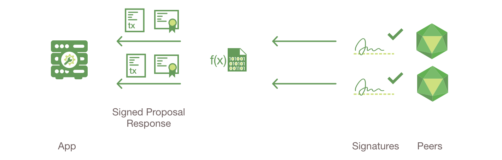

   1. 收到proposal的背书节点检查
      1. proposal是否合法
      2. 是否已经被提交
      3. 检查proposal是否被调用者用户Client A正确签名
      4. 确保Client A 有权利去执行该操作
   2. 把proposal提供参数作为chaincode的输入，根据当前的world state进行执行，生成事务结果，包括response value、read set、write set。目前不会对ledger进行修改
   3. 以上的事务结果在被背书节点签名后，作为proposal response返回给Client A

3. 检测proposal response

   1. Client A 验证收到的proposal response是否符合签名，并且比较response是否相同
   2. 如果是query response，则不必提交给orderer节点
   3. 把其中一致的proposal response写入到transaction中，判断是否满足背书政策，如果满足再提交给orderer节点，当然之后会有其他措施保证其符合

4. 客户端合并背书到事务中，并且将事务发送给排序服务，完成排序上链

   交易中包含读写集、背书节点的签名和channel ID，排序节点无需完成最终检查任务，只需要把事务按时间和channel进行排序，并且创建事务block

5. 区块分发，事务被验证和提交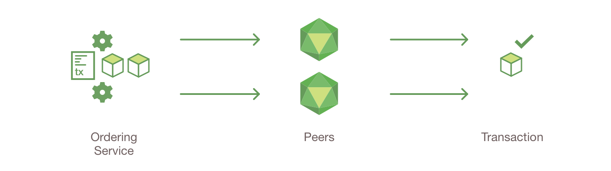

   1. 排序节点把封装有transaction的block分发给所有加入对应channel的peers
   2. 每个peer会去检查区块中的事务
      1. 事务是否符合背书策略
      2. 根据事务中的read set，判断world state是否在期间有被修改过
   3. 根据以上判断，给block中的每个transaction打上是否有效的标签

6. 修改账本

   1. peer节点将区块添加到区块链上
   2. 将所有有效的事务的写集提交给world state 数据库
   3. 发送一个event给Client A，通知事务是否有效

   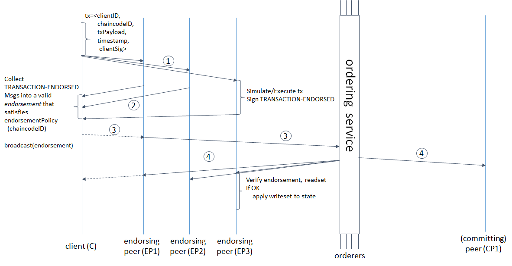


oldValue getValue(key)

putValue(key, newValue)

读集：

​	key: oldValue

写集：

​	key: newValue


世界状态

事务里面：读写集


## 3、前置知识


### 3.1 grpc服务器

gRPC是google开发的go语言RPC框架，它会采用ProtoBuffer的形式传输数据，跟http采用的json不同，二进制效率更高，还有很多细节我都不是很清楚。但是关键的内容在于grpc可以注册服务。发送端使用对应的Client发送消息，消息中会指明服务名、ServiceDesc来定位一个处理器；接收端则会接收消息，分派给合适的处理器处理。


举一个Gossip服务的例子

```go
// 服务描述
var _Gossip_serviceDesc = grpc.ServiceDesc{
	ServiceName: "gossip.Gossip",
	HandlerType: (*GossipServer)(nil),
	Streams: []grpc.StreamDesc{
		{
			StreamName:    "GossipStream",
			Handler:       _Gossip_GossipStream_Handler,
			ServerStreams: true,
			ClientStreams: true,
		},
	},
	Metadata: "gossip/message.proto",
}

// 服务注册，把服务描述和对应的服务注册到grpc服务器中
func RegisterGossipServer(s *grpc.Server, srv GossipServer) {
	s.RegisterService(&_Gossip_serviceDesc, srv)
}

// grpc客户端
type GossipClient interface {
	// GossipStream is the gRPC stream used for sending and receiving messages
	GossipStream(ctx context.Context, opts ...grpc.CallOption) (Gossip_GossipStreamClient, error)
}

// 一个实现方法
func (c *gossipClient) GossipStream(ctx context.Context, opts ...grpc.CallOption) (Gossip_GossipStreamClient, error) {
    // 指定了对应的服务名和ServiceDesc
	stream, err := c.cc.NewStream(ctx, &_Gossip_serviceDesc.Streams[0], "/gossip.Gossip/GossipStream", opts...)
    // 返回了用于传输的连接客户端
	x := &gossipGossipStreamClient{stream}
	return x, nil
}
// 连接客户端
type Gossip_GossipStreamClient interface {
	Send(*Envelope) error			// 它将用于传输pb消息
	Recv() (*Envelope, error)		// 好像因为rpc支持双向传输，client也是可以接收消息的
	grpc.ClientStream
}

// grpc服务端
type GossipServer interface {
	// GossipStream is the gRPC stream used for sending and receiving messages
	GossipStream(Gossip_GossipStreamServer) error
}

// 处理器做的事情就是，调用注册入的grpc服务对应的方法，并传入连接服务器这个参数
func _Gossip_GossipStream_Handler(srv interface{}, stream grpc.ServerStream) error {
	return srv.(GossipServer).GossipStream(&gossipGossipStreamServer{stream})
}
// 连接服务器
type Gossip_GossipStreamServer interface {
	Send(*Envelope) error
	Recv() (*Envelope, error)		// 它将用于接收pb消息
}
```

这个大概就是grpc服务器的简单应用，我们之后讨论的所有通讯关系都是基于grpc的，所有通讯的起点都是找到对应的服务，然后看它会进行怎样的处理，这也是我阅读源码的方式。


## 4、交易流程中涉及的通讯

根据第2部分中的交易流程讲解期间的通讯。其中步骤1、3大多涉及客户端部分，步骤4涉及排序服务，我暂时还没有搞明白，只能直接讲解它们之间的通讯。


### 流程1、2 与 Endorse服务

流程1、2都是关于客户端发送TransactionProposal给Endorser节点，并进行背书服务。

大致流程如下：

1. 客户端封装好交易Proposal，根据policy要求，将Proposal发送给Endorser节点，请求Endorse服务，主要传输SignedProposal
2. Endorser节点验证Proposal，判断Proposal的交易所需链码，启动对应的链码容器（如果未启动），然后异步向容器发送ChaincodeMessage（还细分多种类型，这里的是Transaction），并开始阻塞等待结果
3. 链码容器调用chaincode-shim中stub的putState方法（以此为例，getState等都类似），向endorser节点新绑定的端口（4中解释）发送PutState的ChaincodeMessage
4. Endorser节点会额外启动一个grpc服务器去监听一个端口（默认peer节点监听7051，链码监听端口7052）。它会处理来自链码容器的ChaincodeMessage，它会通过低层操作状态数据库的模块来查询状态的结果，来生成读集；再根据要修改的结果来生成写集，最后将模拟出的结果返回给Chaincode，返回的消息类型为Response的ChaincodeMessage
5. 链码容器在执行完链码后，会发送Completed的ChaincodeMessage给Endorser链码监听端口，监听端口线程会通知主线程执行完毕，事务模拟器由于运行在监听端口线程中，与主线程共享交易执行完毕的读写集。
6. Endorser节点将读写集签名和封装为Response，并且返回给客户端

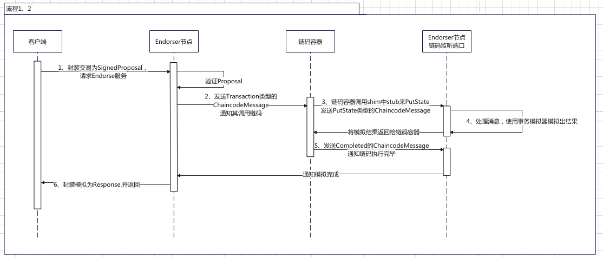


### 流程3、4 与 Broadcast服务

流程3没有太多可以讲的，也基本不涉及节点间的通讯。但是流程4中，交易会由客户端通过AtomicBroadcast服务向Orderer节点提交

大致的流程如下：

1. 客户端将交易打包成Envelope，并通过AtomicBroadcast服务发送给Orderer节点
2. Orderer节点对Envelope进行验证并异步地进行排序，这块我还没有太多了解
3. Orderer节点在提交排序的任务后，直接返回BroadcastResponse


### 流程5 与 Deliver服务

流程5主要完成前两项工作，因为这个过程和流程6在逻辑和代码上非常接近，我就一起讲了

1. Leader节点通过Deliver服务向Orderer节点请求新区块
2. 验证区块，重点在判断区块中事务的有效性
3. 通过Gossip服务将区块应用到账本中（包括将区块写入到区块文件中和将新的键值对写入到状态数据库中）
4. 通过Gossip服务将区块散播给其他节点

其中步骤3、4是流程6要完成的主要任务之一，这里算是预告。然后步骤2不涉及通讯，就不多讲了。


调用Deliver服务的流程大致如下：

Leader节点在Channel初始化的过程中，会启动Deliver客户端，它会启动一个新线程来不断请求新区块，单个循环的流程：

0. 取得当前账本高度，决定好要取得区块的区间，再附带上该节点的身份信息等，构成一个SeekInfo
1. 随机选择一个Orderer节点，与之建立grpc连接，该连接会维持这整一个循环
2. Leader节点将SeekInfo打包成Envelope发送给Orderer节点
3. Orderer节点收到SeekInfo后，首先验证，然后根据SeekInfo要求的最低区块，得到其对应的迭代器
4. Orderer节点通过迭代器不断取得下一个区块，并打包成DeliverResponse_Block发送给Leader节点，不断重复直到满足SeekInfo
5. 满足SeekInfo后，Orderer节点发送DeliverResponse_Block消息，通知SeekInfo已经完整发送
6. 断开连接，重新回到步骤0，准备下一轮的区块请求

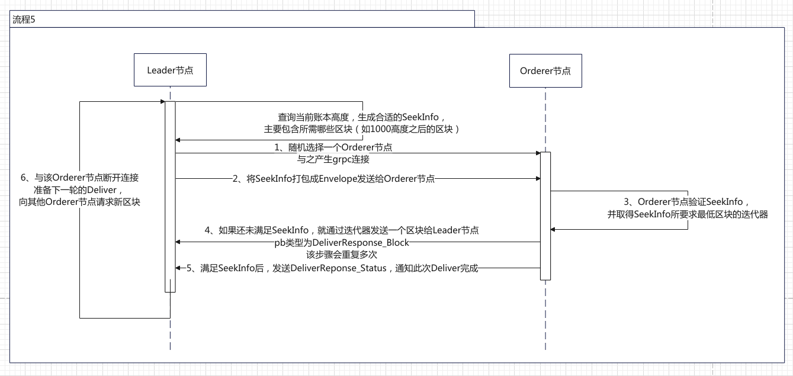


### 流程6 与 Gossip服务

流程6的讲解会不同于上面，因为Gossip服务过于复杂，远远不止区块添加这一个功能，各个功能之间不会有明显的时序性，我们将侧重点放在Gossip服务本身上，先分析其起分发器作用的comm模块，再根据Gossip消息类型介绍功能，最后整合来讲节点之间添加区块并达成一致的过程，顺便提一下，Gossip服务主要用于Peer之间。


#### Comm模块 与 GossipMessage

Comm模块主要负责两项任务：1. 处理收到的GossipMessage  2. 生成点对点的连接，并发送GossipMessage

1、处理收到的GossipMessage

Comm模块的核心类CommImpl是Gossip服务的实现类，它会负责处理所有来自其他节点的GossipMessage，它的处理方式很类似gRPC服务器，也是采用类似订阅发布（观察者模式）的设计模式。

它允许其他模块订阅一些类型的GossipMessage，Comm在收到对应的GM后，就会把消息发布给对应的模块，让其处理消息。不过，它倒不是简单地每个模块订阅一个类型的GossipMessage，具体的订阅过程可以看下面的GossipMessage的处理树，不过重点不在上面。


GossipMessage有以下类型，还可以根据功能稍微划分一下：

1. 节点发现服务
   - GM_AliveMsg
   - GM_MemReq
   - GM_MemRes
2. 区块散播
   - GM_DataMsg
3. 区块拉取
   - GM_Hello
   - GM_DataDig
   - GM_DataReq
   - GM_DataRes
4. 连接（直接在下面简单提一下）
   - GM_Empty（很简单，不讲）
   - GM_Conn（过程很相似TCP三次握手，不过是属于较底层的，也不是重点）
5. 节点状态信息分享
   - GM_StateInfo
   - GM_StateSnapshot
   - GM_StateInfoPullReq
6. 反熵，主动请求一连串区块（区块拉取是问别人有啥再要）
   - GM_StateReq
   - GM_StateRes
7. Leader选举（我暂时还没学，只是说有点啥消息）
   - GM_LeadershipMsg
   - GM_PeerIdentity
   - GM_Ack
8. 私有数据处理
   - GM_PrivateReq
   - GM_PrivateRes
   - GM_PrivateData


然后我再放一个各种GossipMessage被各个模块处理的树形结构

<a href="http://assets.processon.com/chart_image/62cdc12af346fb06f55c2d1f.png">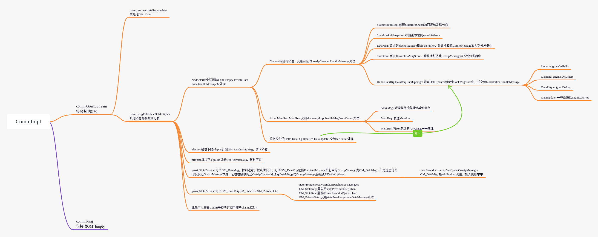</a>


2、生成点对点的连接，并发送GossipMessage

Comm生成连接的方式是：

1. 使用gRPC生成grpc层面的客户端连接
2. 通过grpc连接发送GM_Empty来Ping目标节点（Gossip服务提供Ping和GossipStream两种服务）
3. 直接调用GossipStream服务，互相发送GM_Conn完成Gossip层次的三次握手以验证身份，并正式生成连接

GossipMessage最特别的就是GM_Empty和GM_Conn，GM_Empty会通过Ping服务来发送和处理，GM_Conn虽然也通过GossipStream服务发送，但是它是直接通过调用服务发送的。

创建连接后，其他所有GossipMessage将会由连接进行发送，连接可以视为对GossipStream服务和点对点连接的一个封装。

Comm模块会负责对连接管理，它会以pkiID2Conn的方式去保存连接，必要时关闭对应的连接。


#### 节点发现服务 与 Discovery子模块

节点发现服务的作用就是让节点发现网络中有哪些其他节点。

一个节点会维护其他节点的状态，状态有三种：活的、死的、不认识的。整个节点发现服务就是在维护节点的状态，这个过程是没有很强的时序性的，我会一点点地介绍该模块会改变节点的状态的机制。

1. 在模块的基础机制和GM_AliveMsg的作用下，节点的状态会有以下的变化情况：

   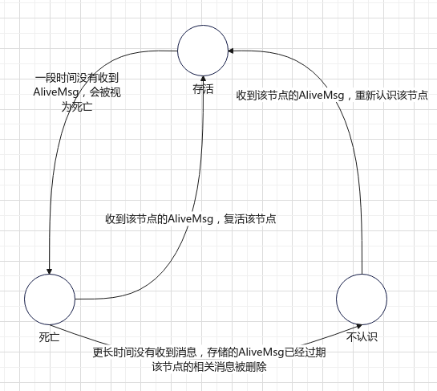

2. 本节点会周期性地向其他节点发送GM_AliveMsg，通知本节点活着，其他节点收到AliveMsg除了会修改对应节点的状态外，还会继续散播该消息

3. 本节点会周期性地向被视为死亡的节点发送GM_Empty消息来Ping这些节点，查看死活，之后做什么看下一条

4. 本节点可以向其他节点发送GM_MemReq，请求其他节点当前存储的节点存活信息，收到GM_MemRes后，可以得知其所知的存活节点和死亡节点，对于存活节点，它会将这些存活信息视为GM_AliveMsg处理，而对于死亡节点，只会认识一下，添加到死亡节点中。此外，当然都能收到它的GM_MemRes，该节点必然是存活的。

   GM_MemReq会在以下三种情况下发送：

   1. comm会周期性地让Discovery模块去随机向k（设置的）个存活节点发送
   2. 成功复活一个死亡的节点后，向其发送，就是刚刚的机制3说的
   3. 当连接到Anchor节点和bootstrap节点（这个我不是很了解）后会向其发送

   在加入这些机制后，状态转换会变成

   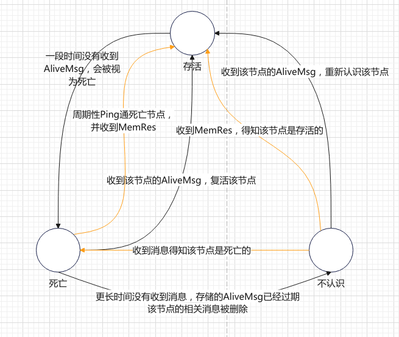

该服务发现的一个重要应用就是Gossip服务的散播（Gossip）功能，它的实现方式就是通过discovery服务找到节点，然后再通过comm模块下的点对点连接来对所有找到的节点散播消息。


#### 区块散播 与 DataMsg

区块散播是区块链达成最终一致性的最核心的方式，但是它过程并不复杂：

1. 区块散播最初发生在Leader节点调用Deliver服务取得区块后，Leader节点除了会把区块写入账本，还会把区块封装到GM_DataMsg中，散播给其他节点。
2. 其他节点收到DataMsg后，除了将它加入到账本中外，也会将该DataMsg继续散播给其他节点。

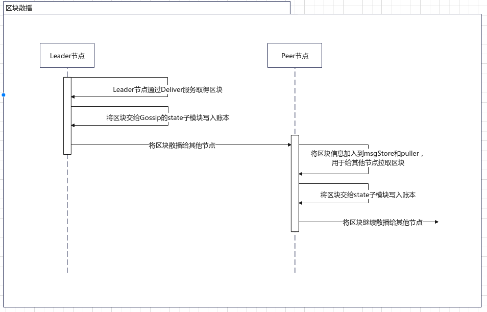

它往往能解决大部分一致性的问题，它会被动地接收其他节点的区块；此外，还有两种主动取得区块的机制，它们就将在后面介绍：

1. 区块拉取，问别人有啥区块（不一定要已经加入到账本，加入到msgStore和puller即可），再从中挑选我没有的
2. 反熵，找账本高度最高的人索要比自己高的部分


#### 区块拉取 与 Pull子模块

区块拉取的作用就是为了账本的最终一致性，它的工作流程也向上面说的一样，先问别人有啥区块，从中挑选出自己要的，再让别人发给你。

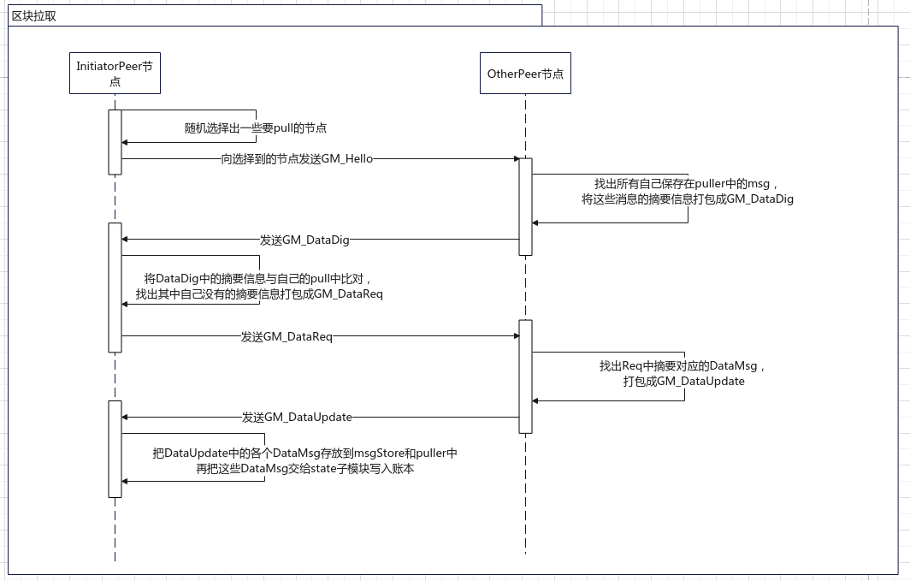

除了这个流程之外，我们要关心的问题就是puller是如何维护它存储的GM_DataMsg的。通常puller中的DataMsg和msgStore是同步的，

DataMsg添加会发生在：

1. 区块散播，收到GM_DataMsg，在写入账本前会先写入msgStore和puller中
2. 收到GM_DataUpdate，也会把其中的DataMsg写入到msgStore和puller中
3. 散播消息时，如果是GM_DataMsg，也会写入两者（这应该是专门给Leader节点用的）

在将DataMsg删除之前，我们首先得知道MessageStore，它的特点是存储的数据会过期，且可以过期回调函数，其实之前的Discovery模块中实现从死亡到不认识也是靠这个过期回调。DataMsg的删除靠的就是MsgStore的过期功能，在msgStore的消息过期后，它同时也会删除puller中的消息


#### 反熵 与 state子模块

因为之前都是在讲把DataMsg交给state子模块写入账本，还有各种达成数据最终一致性的方法，所以我们先把这块内容插队讲一下，让节点状态信息共享的内容放后面。

1、写入账本功能

首先，我们先讲state子模块是如何将区块写入账本的，准确的说是state子模块除了调用kvLedger来将区块写入账本以外还提供了其他什么功能，kvLedger是实际上将区块写入账本的实现类。state子模块主要为该功能提供了缓存的功能，它能提前接收后续的区块，采用滑动窗口的方式接收和提交区块。

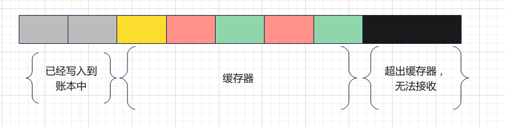

- 灰色：已经写入到区块中
- 黑色：超过缓存器，无法缓存
- 黄色：下一个待写入账本的区块，到达后即可窗口右移一格
- 绿色：已经到达并被缓存的区块
- 红色：暂未到达的区块，等待到达

当黄色对应的区块到达时，窗口即可右移，将该区块写入到账本中，不过此处调用的是privdata子模块的coordinator，它也仅仅是为kvLedger提供加强方法，coordinator会在私有数据部分介绍。


2、反熵功能

该功能就像之前说的，向其他节点索要账本中比自己高的部分，该过程会周期性地执行。

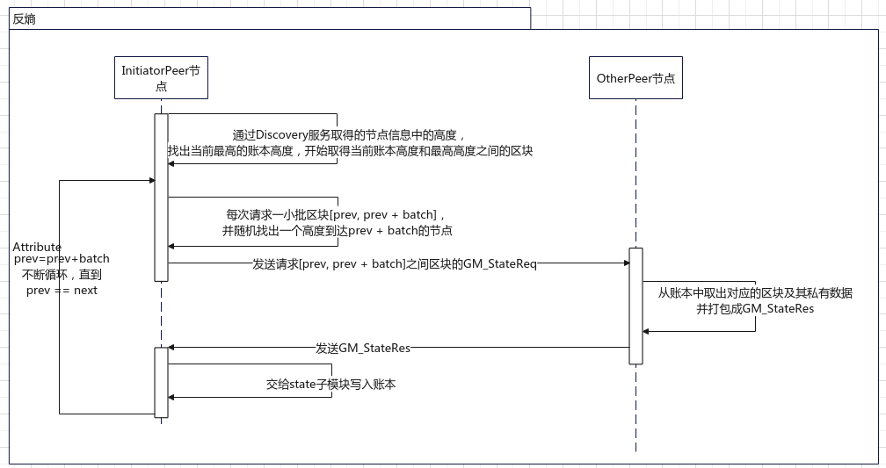


#### 节点状态信息分享 与 channel子模块

节点状态信息分享只是channel子模块的一个功能，channel子模块会统筹其他子模块完成与该channel相关的功能，但是此处我们只考虑节点状态信息分享。

它的机制比较类似节点发现服务，功能也是提供其他节点的信息，AliveMsg主要提供了节点是否存活、节点账本高度、endpoint、pkiID、系统时间等信息，而StateInfoMsg会提供更多信息，例如安装了哪些链码，是否属于channel（stateInfo是channel作用域下的，由gossipChannel管理）等。

节点状态信息共享有着和节点发现服务很类似的机制：

1. 周期性发送自己的状态GM_StateInfo，其他节点收到会存入到一个stateInfoMsgStore，并散播给其他节点。stateInfoMsgStore和AliveMsgStore类似，里面的消息也会过期。
2. 周期性向随机几个节点发送GM_StateInfoPullReq，收到该消息的节点会从stateInfoMsgStore取出所有StateInfo消息，打包成一个GM_StateInfoSnapshot并发送给请求者

因为和节点发现服务很类似，我连画图都懒得画了。。。


#### 私有数据 与 privdata子模块

先科普一下什么叫私有数据。。。大概，这块我之前看到就跳过的，最近才学，而且我还从没有应用过。

- 私有数据是由链码创建的，以链码为作用域的数据
- 它的每个键值对可以通过[channel, namespace, collection, key]来进行定位
  - channel：即链码所属的channel
  - namespace：即链码的id，这是链码的隐式属性
  - collection：集合，由链码创建，是私有数据库中的存储单位，本身也可以视为一个逻辑上的非关系型数据库
  - key：存储在集合中的键
- 私有数据库中存储私有数据集合的键为[blockNum, txNum, namespace, collection]，存储的内容为私有数据在模拟时产生的键值对
  - blockNum：区块号
  - txNum：交易在区块的第几个
- 链码在提交时，可以创建私有数据，创建私有数据需要设置一个配置，内容大致包括：
  - Name：集合名
  - MemberOrgsPolicy：判断是否是该私有数据集合的成员，它将决定哪些角色有权限存储私有数据
  - RequiredPeerCount：背书节点至少需要将私有数据发送给多少节点存储
  - MaximumPeerCount：背书节点至多可以发送给多少节点
  - BlockToLive：私有数据会在区块链中存活多久
- 世界状态数据库中不会存入私有数据，仅保存键和值的hash值，用于告知该数据已经提交到账本中
- 私有数据的流动大概是下面这个过程：
  1. 客户端应用程序提交一个提案请求，让属于授权集合的背书节点执行链码函数（读取或写入私有数据）。 私有数据，或用于在链码中生成私有数据的数据，被发送到提案的 `transient`（瞬态）字段中。
  2. 背书节点模拟交易，并将私有数据存储在 `瞬态数据存储`（ transient data store ，节点的本地临时存储）中。它们根据组织集合的策略将私有数据通过[gossip](https://hyperledger-fabric.readthedocs.io/zh_CN/latest/gossip.html)分发给授权的 Peer 节点。
  3. 背书节点将提案响应发送回客户端。提案响应中包含经过背书的读写集，这其中包含了公共数据，还包含任何私有数据键和值的 hash。*私有数据不会被发送回客户端*。更多关于带有私有数据的背书的信息，请查看[这里](https://hyperledger-fabric.readthedocs.io/zh_CN/latest/private-data-arch.html#endorsement)。
  4. 客户端应用程序将交易（包含带有私有数据 hash 的提案响应）提交给排序服务。带有私有数据 hash 的交易同样被包含在区块中。带有私有数据 hash 的区块被分发给所有节点。这样，通道中的所有节点就可以在不知道真实私有数据的情况下，用同样的方式来验证带有私有数据 hash 值的交易。
  5. 在区块提交的时候，授权节点会根据集合策略来决定它们是否有权访问私有数据。如果节点有访问权，它们会先检查自己的本地 `瞬态数据存储` ，以确定它们是否在链码背书的时候已经接收到了私有数据。如果没有的话，它们会尝试从其他已授权节点那里拉取私有数据，然后对照公共区块上的 hash 来验证私有数据并提交交易和区块。当验证或提交结束后，私有数据会被移动到这些节点私有数据库和私有读写存储的副本中。随后 `瞬态数据存储` 中存储的这些私有数据会被删除。


privdata子模块为了完成上面的数据流程，会进行以下的流程：

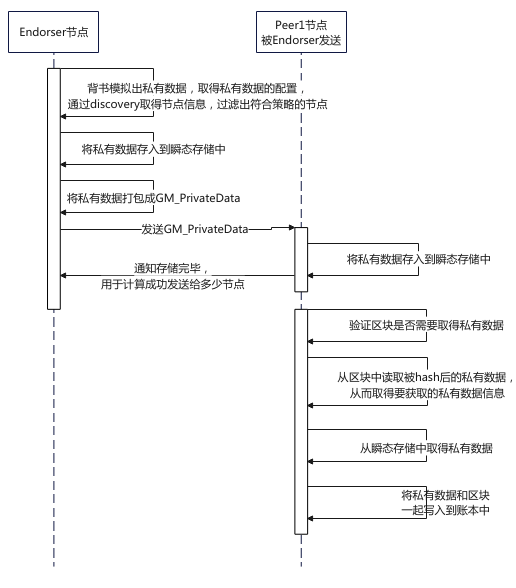

1. 这里首先由背书节点在模拟完交易后，将私有数据部分打包成GM_privateData发送给有权限的节点，节点接收到后就会把私有数据存入到瞬态存储中
2. 后续到节点要提交区块的时候，会检查区块是否需要取得私有数据，然后再取得要获取哪些私有数据，然后尝试从瞬态存储中取得，取得成功后就可以提交到账本中了

当然事事不可能那么顺心，在提交区块的阶段会有以下情况，我用流程图来表示：

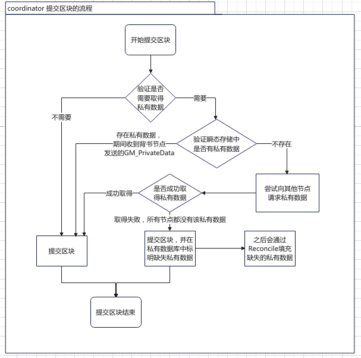

大致情况分为三种：

1. 收到Endorser节点发送的GM_PrivateData，在瞬态存储中直接取得
2. 瞬态存储中没有，但是成功从其他节点处取得
3. 无法从其他节点处取得，只能先提交区块，并标记出缺少了哪些私有数据，尝试通过reconcile取得

上面的时序图就是情况1，现在再讲讲其他两种情况

情况2：

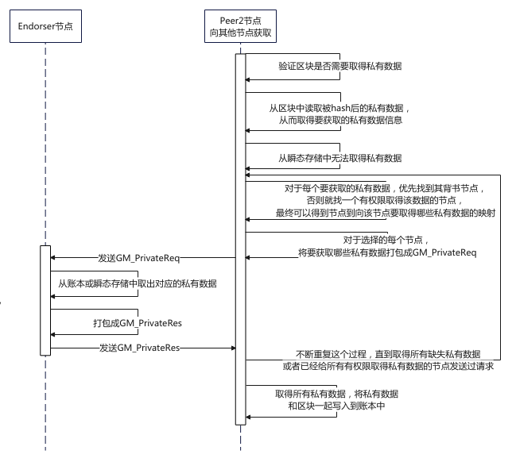

情况3：

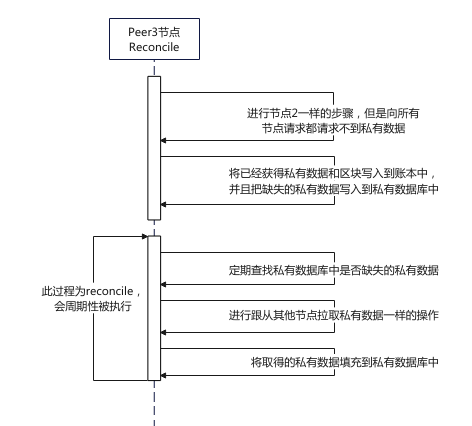

这基本就是privdata子模块实现私有数据流动的过程。

但是还有一个点要讲一下，那就是coordinator，之前我们在state子模块中提到，state提交区块的功能只是提供一个缓存的功能，实际上调用的coordinator的StoreBlock功能，那么coordinator做了什么呢？

coordinator主要提供了取得私有数据的功能，其中的情况1、2就是coordinator做到的，之后它将调用PeerLedger.CommitLegacy从而调用kvLedger来真正地将区块写入到账本中


## 5、总结

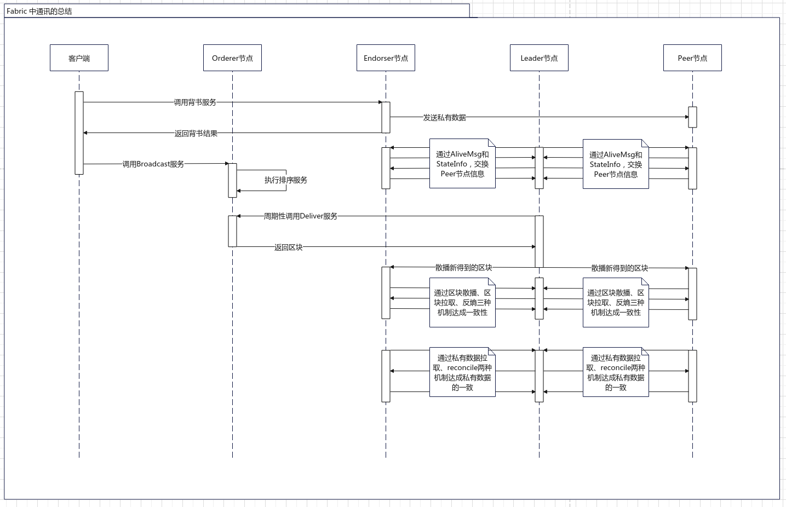